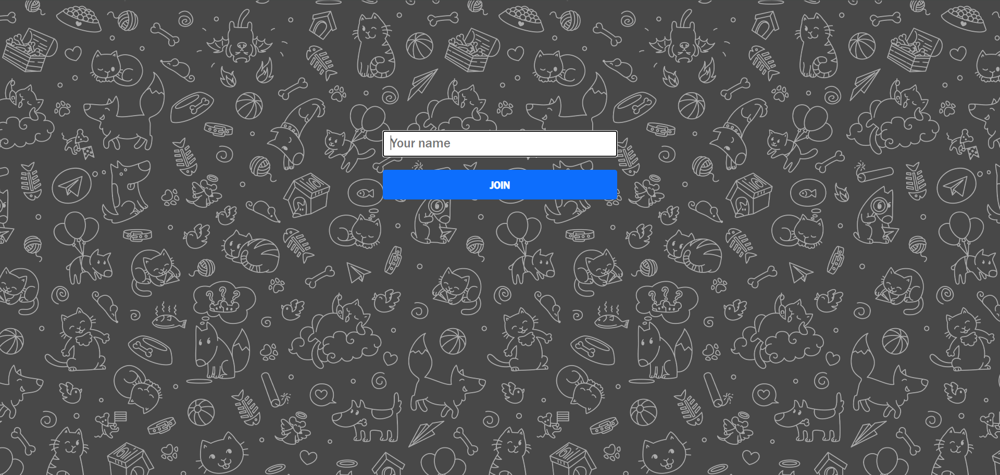
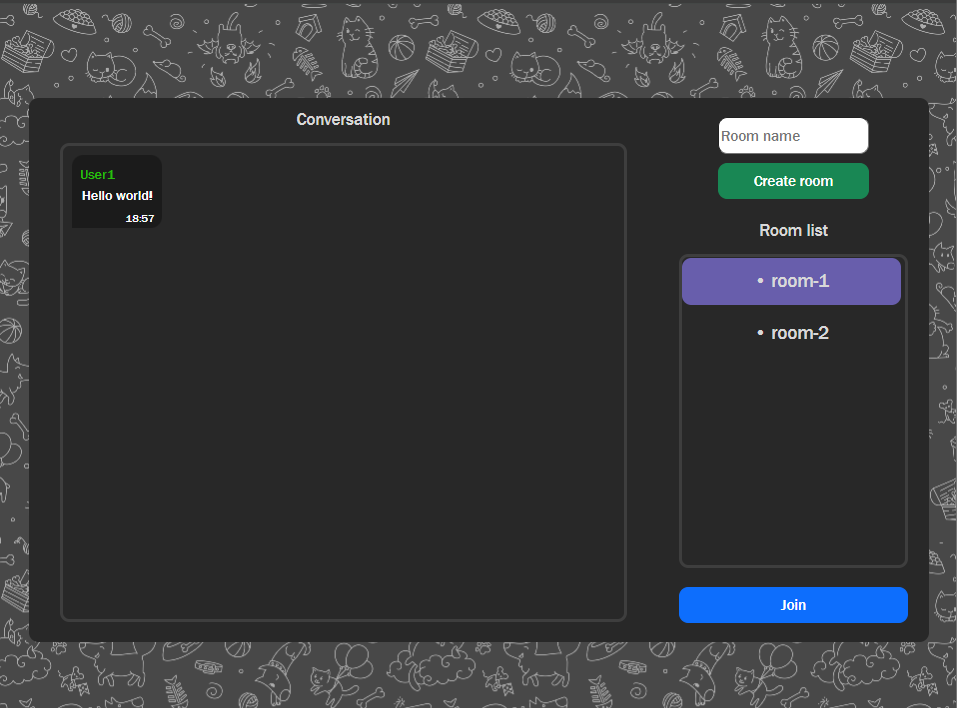
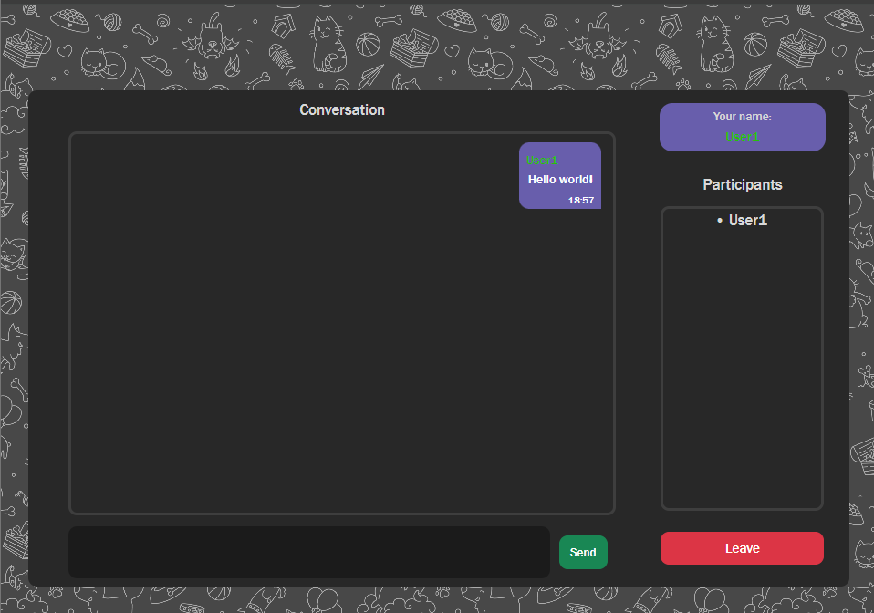
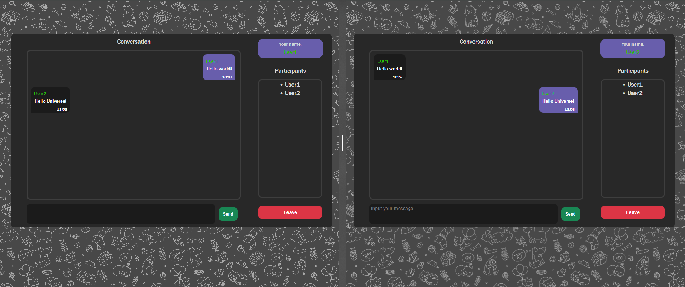

# CHAT APP

A socket-based chat app

### Technologies:

* JavaScript
* Socket
* React
* SCSS
* Bootstrap

### How to run the app

* Open a terminal and run the command: `git clone https://github.com/askador/chat-app.git`
* Move to the project: `cd chat-app`
* Run the server. Move to the server directory `cd server `, then run the server `npm run start`
* Run the clien. Move to the client directory `cd client`, then run the client `npm run client`

### Interface

**Login page:**

**User in lobby:**

**User in room:**

**Two users in room:**

> Two different windows but super close

